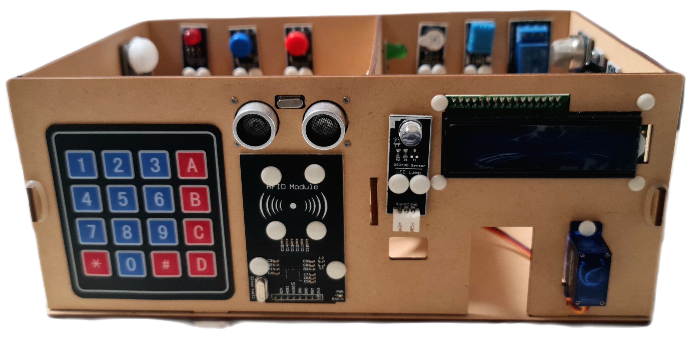

## Lesson 2: Model Installation

### 1. 部品とデバイス

| No. | Device Name                     | デバイス名                | 個数 | 付属品   |
|:----|:--------------------------------|:---------------------|:--:|:------|
| 1   | Wooden House Model              | 木製ハウスモデル             | 1  | ゴムリング |
| 2   | OSOYOO MEGA2560 Board           | OSOYOO MEGA2560ボード   | 1  | -     |
| 3   | OSOYOO MEGA-IoT Extension Board | OSOYOO MEGA-IoT拡張ボード | 1  | -     |
| 4   | Photosensitive Sensor           | 感光センサー               | 1  | -     |
| 5   | Temp & Hum Sensor               | 温湿度センサー              | 1  | -     |
| 6   | Buzzer Module                   | ブザーモジュール             | 1  | -     |
| 7   | Flame Detection Sensor          | 火炎検知センサー             | 1  | -     |
| 8   | 1-Channel Relay                 | 1チャンネルリレー            | 1  | -     |
| 9   | Micro Servo Motor               | マイクロサーボモーター          | 1  | -     |
| 10  | RGB Module                      | RGBモジュール             | 1  | -     |
| 11  | Ultrasonic Sensor               | 超音波センサー              | 1  | -     |
| 12  | PIR Motion Sensor               | PIRモーションセンサー         | 1  | -     |
| 13  | Microphone Module               | マイクモジュール             | 1  | -     |
| 14  | 1602 I2C LCD Screen             | 1602 I2C LCDスクリーン    | 1  | -     |
| 15  | Gas Detection Module            | ガス検知モジュール            | 1  | -     |
| 16  | RFID Module                     | RFIDモジュール            | 1  | -     |
| 17  | 4×4 Keypad                      | 4×4キーパッド             | 1  | -     |
| 18  | Yellow LED Module               | 黄色LEDモジュール           | 1  | -     |
| 19  | Red LED Module                  | 赤色LEDモジュール           | 1  | -     |
| 20  | Green LED Module                | 緑色LEDモジュール           | 1  | -     |
| 21  | White LED Module                | 白色LEDモジュール           | 1  | -     |
| 22  | Red Button Module               | 赤色ボタンモジュール           | 1  | -     |
| 23  | Blue Button Module              | 青色ボタンモジュール           | 1  | -     |
| 24  | Philips Screwdriver             | プラスドライバー             | 1  | -     |
| 25  | M1.4×10 Screw & Nut             | M1.4×10 ネジ・ナット       | 4  | -     |
| 26  | M2 Push Pin Rivets              | M2 プッシュピンリベット        | 2  | -     |
| 27  | M3 Push Pin Rivets              | M3 プッシュピンリベット        | 10 | -     |
| 28  | M4 Push Pin Rivets              | M4 プッシュピンリベット        | 38 | -     |

### 2. 組み立て手順

#### 1. フロアボード (Floor Board)

OSOYOO MEGA-IoT拡張ボードをOSOYOO Mega2560ボードに差し込む。  
（既に差し込まれている場合はそのままで）  
M3プッシュピンリベットを使用して、OSOYOO Mega2560ボードを木製フロアボードに取り付ける。  
注意: M3プッシュピンリベットはフロアボードの裏側から取り付ける  

#### 2. バックボード (Back Board)

M4プラスチックファスナーを使用して、以下のモジュールをバックボードに取り付ける。  

- Red LED Module（赤色LEDモジュール）
- Blue Button Module（青色ボタンモジュール）
- Red Button Module（赤色ボタンモジュール）
- Buzzer Sensor（ブザーモジュール）
- DHT11 Module（DHT11モジュール）
- Relay Module（リレーモジュール）

#### 3. 左ボード (Left Board)

M4プラスチックファスナーを使用して、以下のモジュールを左ボードに取り付ける。

- PIR Motion Sensor（PIRモーションセンサー）
- RGB Module（RGBモジュール）

#### 4. 右ボード (Right Board)

M4プラスチックファスナーを使用して、以下のモジュールを右ボードに取り付ける。

- Gas Detection Module（ガス検知モジュール）
- Microphone Module（マイクモジュール）
- Flame Detection Sensor（火炎検知センサー）
- Photosensitive Sensor（感光センサー）

#### 5. パーティションボード (Partition Board)

M4プラスチックファスナーを使用して、以下のモジュールをパーティションボードに取り付ける。

- Yellow LED module（黄色LEDモジュール）
- Green LED module（緑色LEDモジュール）

#### 6. フロントボード (Front Board)

以下のモジュールをフロントボードに取り付ける。

- 4×4 Keypad（4×4キーパッド）
- Ultrasonic Sensor（超音波センサー）
- RFID Module（RFIDモジュール）
- White LED Module（白色LEDモジュール）
- I2C 1602 LCD Module（I2C 1602 LCDモジュール）
- Micro Servo Motor（マイクロサーボモーター）

#### 7. 組み立て (Assemble)

- Step 1: バックボードをフロアボードに差し込み、ゴムリングで固定する。
- Step 2: 左ボードをフロアボードに差し込み、ゴムリングで固定する。
- Step 3: 右ボードをフロアボードに差し込み、ゴムリングで固定する。
- Step 4: パーティションボードをフロアボードの中央に差し込む。
- Step 5: L字型パーティションボードを、左ボードとパーティションボードの間に差し込む。
- Step 6: フロントボードをフロアボードに差し込み、ゴムリングで固定する。

