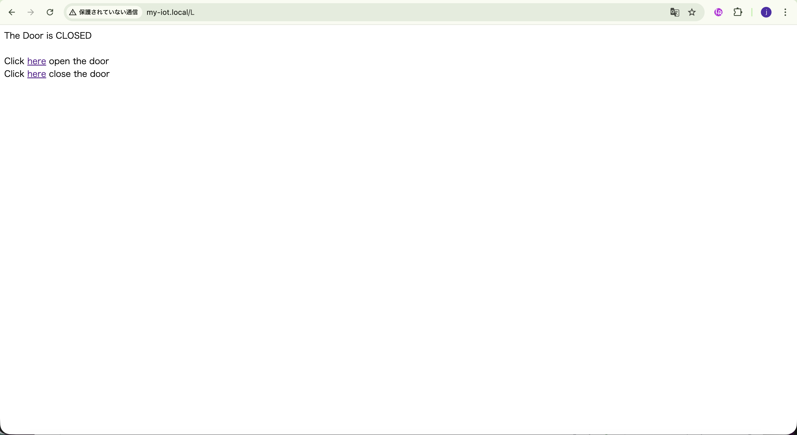

## Lesson 8: ドアの開閉制御 (Switching Door)

### 1. 目的 (Objective)

このレッスンでは、リモートブラウザからサーボを制御する方法を紹介する。
Arduino MEGA2560ボードはWebサーバーとして機能し、リモートブラウザはこのウェブサーバーにアクセスし、MEGA2560のD3ピンに接続されたサーボを制御できる。

### 2. 必要部品とデバイス

- OSOYOO MEGA2560ボード ×1
- OSOYOO MEGA-IoT 拡張ボード ×1
- LED PnPモジュール ×1
- Servo ×1
- 3ピン PnP ケーブル ×1
- USB ケーブル ×1
- PC ×1

### 3. 作り方 (How to Make)

1. OSOYOO MEGA2560ボードの上にOSOYOO MEGA-IoT拡張ボードを差し込む。
2. 3ピンPnPケーブルを使用して、LEDモジュールをOSOYOO MEGA-IoT拡張ボードのD12ポートに接続し、サーボモーターをD3ポートに接続する。  
   （ジャンパーキャップは、ESP8266のRXとA8、TXとA9を接続するようにする）

### 4. コーディング (How to Code)

- Step 1: 最新のArduino IDEをインストール。（スキップ）
- Step 2: WiFiEsp-master ライブラリインストール。（スキップ）  
- Step 3: サーボを使用するには、上記と同じ手順でServoライブラリをインストール。
- Step 4: 以下のリンクからメインコードをダウンロードし、ZIPファイルを解凍する。（スキップ）
  http://osoyoo.com/driver/smarthome/8/smarthome_lesson8.zip
- Step 5: OSOYOO MEGA2560ボードをUSBケーブルでPCに接続する。  
- Step 6: Arduino IDEを開き、プロジェクトに適したボードタイプとポートタイプを選択する。
- Step 7: Arduino IDE: 「File → Open → "smarthome-lesson8"」を選択して、Arduinoにスケッチをアップロードする。
  - 注意: スケッチ内の以下の行を見つけて、WiFiのSSIDとパスワードを自分のネットワークに合わせて変更する。  
  ```cpp
  char ssid[] = "****"; // WiFiのSSIDを入力
  char pass[] = "****"; // WiFiのパスワードを入力
  ```

### 5. 実行方法 (How to Play)

スケッチをArduinoに読み込んだ後、Arduino IDEの右上にあるシリアルモニタを開くと、以下の結果が表示さる。  

- シリアルモニタから、MEGA2560ボードのIPアドレスを確認できる。

次に、ブラウザを使用してウェブサイトにアクセスすると、サーボを制御できる。

|       |                            Web                            |                  Smart Home                  |
|-------|:---------------------------------------------------------:|:--------------------------------------------:|
| OPEN  |    | <video src=assets/lesson08/door_open.mp4 />  |
| CLOSE |  | <video src=assets/lesson08/door_close.mp4 /> |
