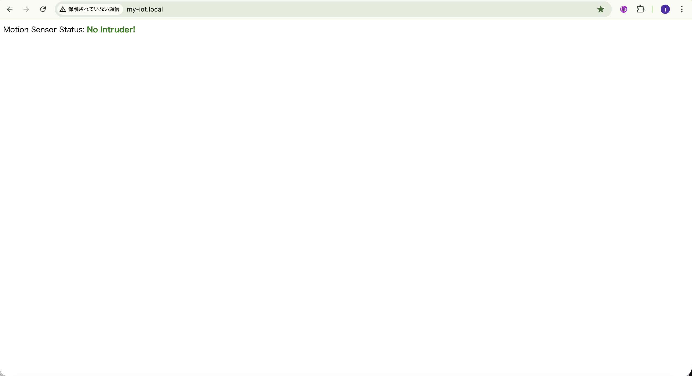
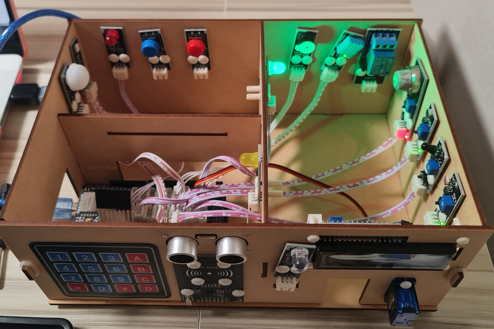
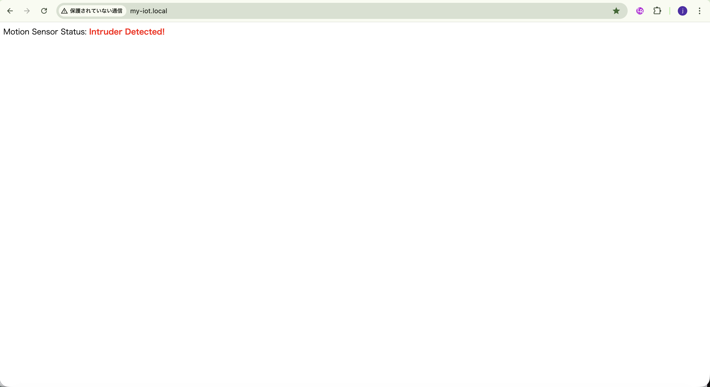
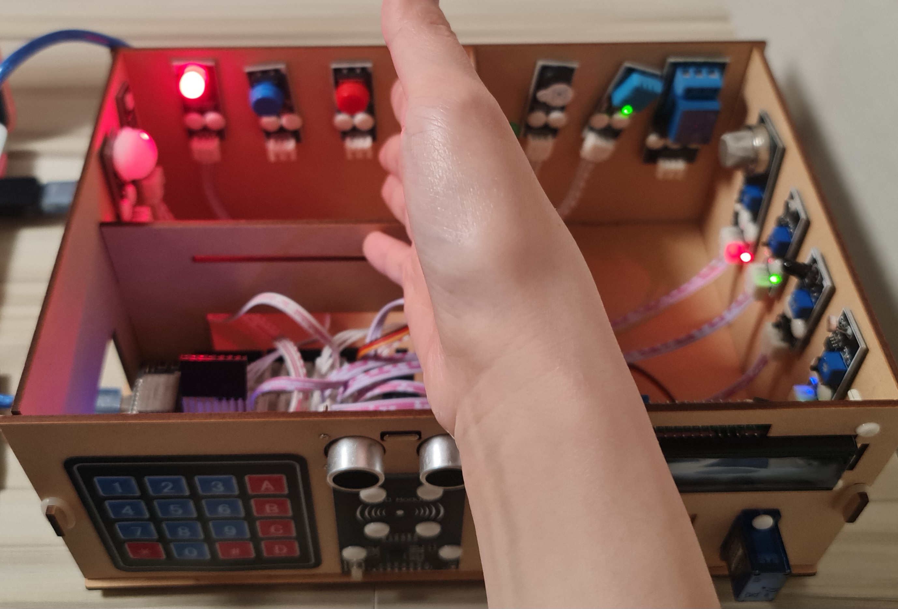

## Lesson 13: PIR動体検知 (PIR Motion Detection)

### 1. 目的 (Objective)

このレッスンでは、インターネットを利用してリモートのモーションセンサーの状態を監視し、侵入者を検知する方法を紹介する。
Arduino MEGA2560ボードはWebサーバーとして機能し、リモートブラウザはこのウェブサーバーにアクセスし、モーションセンサー(PIR)のリアルタイムの状態を表示できる。

### 2. 必要部品とデバイス

- OSOYOO MEGA2560ボード ×1
- OSOYOO MEGA-IoT 拡張ボード ×1
- USB ケーブル ×1
- 赤色LED PnPモジュール ×1
- 緑色LED PnPモジュール ×1
- PIR モーションセンサー PnP モジュール ×1
- ブザーモジュール ×1
- 3ピン PnP ケーブル ×4

### 3. 作り方 (How to Make)

1. OSOYOO MEGA2560ボードの上にOSOYOO MEGA-IoT拡張ボードを差し込む。  
    （ジャンパーキャップは、ESP8266のRXとA8、TXとA9を接続するようにする）
2. 緑色LEDモジュール -- D12
   赤色LEDモジュール -- D11 (※D13にした)
   ブザーモジュール -- D5
   モーションセンサー -- D4 

### 4. コーディング (How to Code)

- Step 1: 最新のArduino IDEをインストール。（スキップ）
- Step 2: WiFiEsp-master ライブラリインストール。（スキップ）  
- Step 3: 以下のリンクからメインコードをダウンロードし、ZIPファイルを解凍する。（スキップ）
  http://osoyoo.com/driver/smarthome/smarthome-lesson13.zip
- Step 4: OSOYOO MEGA2560ボードをUSBケーブルでPCに接続する。  
- Step 5: Arduino IDEを開き、プロジェクトに適したボードタイプとポートタイプを選択する。
- Step 6: Arduino IDE: 「File → Open → "smarthome-lesson13"」を選択して、Arduinoにスケッチをアップロードする。
  - 注意: スケッチ内の以下の行を見つけて、WiFiのSSIDとパスワードを自分のネットワークに合わせて変更する。  
  ```cpp
  char ssid[] = "****"; // WiFiのSSIDを入力
  char pass[] = "****"; // WiFiのパスワードを入力
  ```

### 5. 実行方法 (How to Play)

スケッチをArduinoに読み込んだ後、Arduino IDEの右上にあるシリアルモニタを開くと、以下の結果が表示さる。  

- シリアルモニタから、MEGA2560ボードのIPアドレスを確認できる。

ブラウザを使用してウェブサイトにアクセスすると、
侵入者（動きの信号）が検知されてない場合、MEGA-IoTシールドのD13ピンにある赤色LEDは消灯し、緑色LEDが点灯する。
次に、モーションセンサーに手を近づけると、IoTシールドの緑色LEDが消灯し、赤色LEDが点灯して、ブザーが鳴るのが確認できる。

|                   |                                   Web                                   |                            Smart Home                             |
|-------------------|:-----------------------------------------------------------------------:|:-----------------------------------------------------------------:|
| No Intruder       |              |              |
| Intruder Detected |  |  |


