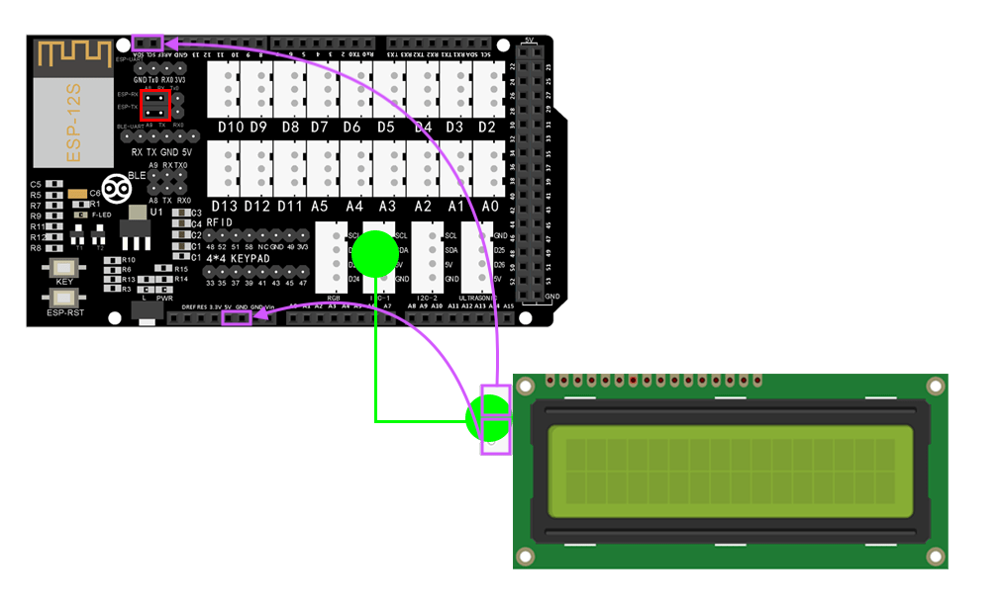
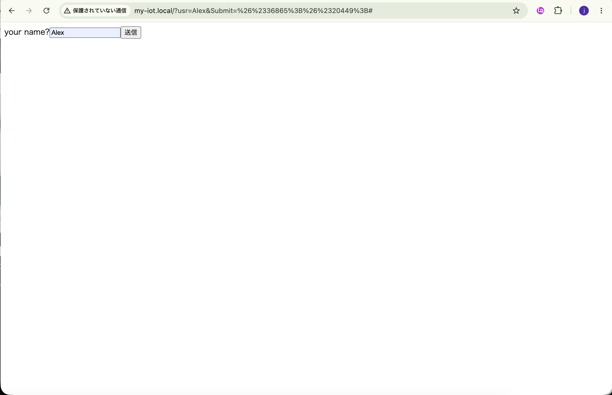
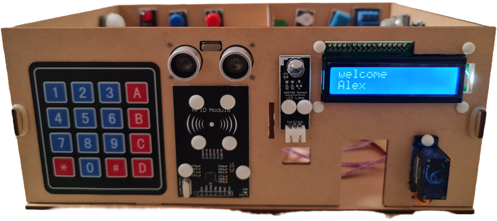

## Lesson 14: LCDスクリーン (LCD Screen)

### 1. 目的 (Objective)

このレッスンでは、インターネットを利用してリモートの16x2 LCDにメッセージを送信する方法を紹介する。
Arduino MEGA2560ボードはWebサーバーとして機能し、リモートブラウザはこのウェブサーバーにアクセスし、
「あなたの名前」という文字列をこのウェブサーバーに送信し、1602 LCD画面に「Welcome あなたの名前」というメッセージを表示できる。

### 2. 必要部品とデバイス

- OSOYOO MEGA2560ボード ×1
- OSOYOO MEGA-IoT 拡張ボード ×1
- USB ケーブル ×1
- 1602 LCD スクリーン PnP モジュール ×1
- 4ピン PnP ケーブル ×4

### 3. 作り方 (How to Make)

1. OSOYOO MEGA2560ボードの上にOSOYOO MEGA-IoT拡張ボードを差し込む。  
    （ジャンパーキャップは、ESP8266のRXとA8、TXとA9を接続するようにする）
2. 1602 LCD スクリーン -- I2C_1 (※I2C_1では上手く動作しないため、以下画像のようにGND、5V、SDA、SCLへに直接繋ぎこみ)

 

### 4. コーディング (How to Code)

- Step 1: 最新のArduino IDEをインストール。（スキップ）
- Step 2: WiFiEsp-master ライブラリインストール。（スキップ）  
- Step 3: I2C ライブラリインストール。
- Step 4: 以下のリンクからメインコードをダウンロードし、ZIPファイルを解凍する。（スキップ）
  http://osoyoo.com/driver/smarthome/smarthome-lesson14.zip
- Step 5: OSOYOO MEGA2560ボードをUSBケーブルでPCに接続する。  
- Step 6: Arduino IDEを開き、プロジェクトに適したボードタイプとポートタイプを選択する。
- Step 7: Arduino IDE: 「File → Open → "smarthome-lesson14"」を選択して、Arduinoにスケッチをアップロードする。
  - 注意: スケッチ内の以下の行を見つけて、WiFiのSSIDとパスワードを自分のネットワークに合わせて変更する。  
  ```cpp
  char ssid[] = "****"; // WiFiのSSIDを入力
  char pass[] = "****"; // WiFiのパスワードを入力
  ```

### 5. 実行方法 (How to Play)

スケッチをArduinoに読み込んだ後、Arduino IDEの右上にあるシリアルモニタを開くと、以下の結果が表示さる。  

- シリアルモニタから、MEGA2560ボードのIPアドレスを確認できる。

ブラウザを使用してウェブサイトにアクセスして、
テキストフィールドにあなたの名前「Alex」を入力し、Submit（送信）ボタンをクリックすると、遠隔のLCD画面にメッセージが表示される。

|            |                            Web                            |                    Smart Home                     |
|------------|:---------------------------------------------------------:|:-------------------------------------------------:|
| LCD Screen |  |  |
