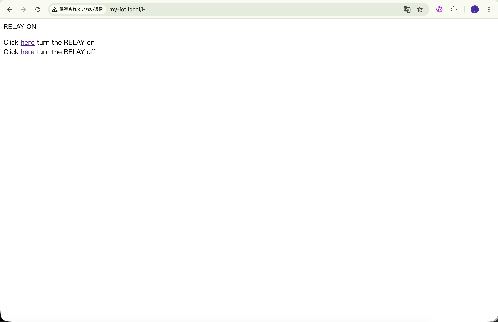
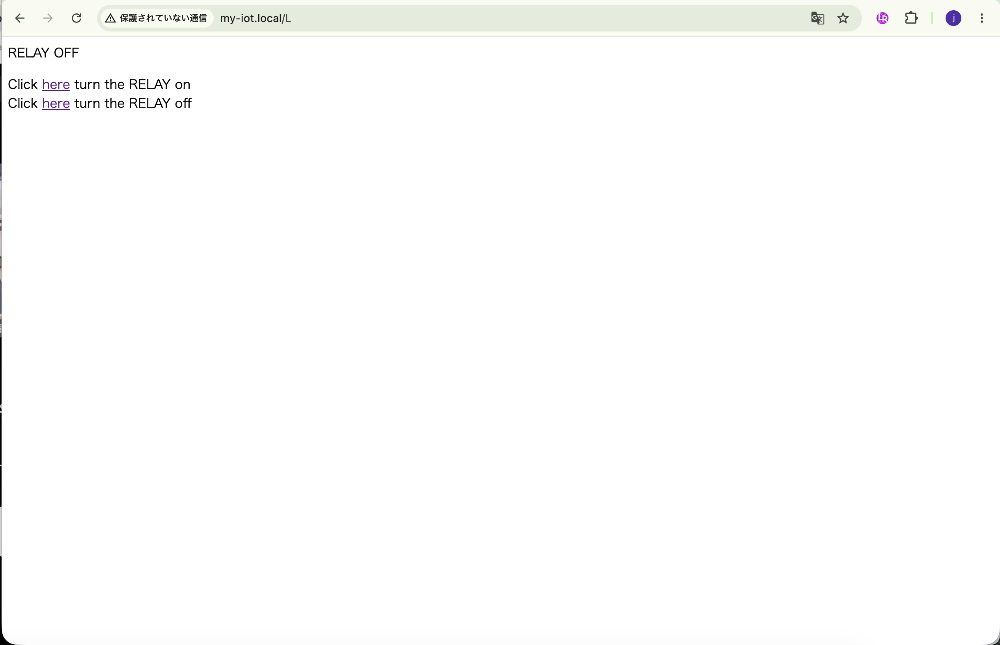

## Lesson 15: 1チャンネルリレー (1-Channel Relay)

### 1. 目的 (Objective)

リレーは、低電圧信号で制御できる便利な電子スイッチである。リレーはコンピューターが高電圧回路を制御するためによく使用される。
このレッスンでは、インターネットを介してリモートブラウザからリレーとブザーをオン/オフにする方法を紹介する。
Osoyoo Mega-IoT Shieldを使用して、リレー、MEGA2560 MCUボードを接続する。
Arduino MEGA2560ボードはWebサーバーとして機能し、リモートブラウザはこのウェブサーバーにアクセスし、 MEGA2560のD6ピンに接続されたリレーを制御できる。

### 2. 必要部品とデバイス

- OSOYOO MEGA2560ボード ×1
- OSOYOO MEGA-IoT 拡張ボード ×1
- USB ケーブル ×1
- リレーモジュール ×1
- ブザーモジュール ×1
- PnPケーブル ×4
- オス-メス ジャンパーワイヤ ×4
- オス-オス ジャンパーワイヤ ×4

### 3. 作り方 (How to Make)

1. OSOYOO MEGA2560ボードの上にOSOYOO MEGA-IoT拡張ボードを差し込む。  
    （ジャンパーキャップは、ESP8266のRXとA8、TXとA9を接続するようにする）
2. リレー - OSOYOO MEGA-IoT拡張ボード
   - リレーモジュール -- D6 
   - COM -- 5V (ジャンパー)
3. ブザーモジュール - OSOYOO MEGA-IoT拡張ボード 
   - VCC -- 5V (ジャンパー) 
   - GND -- GND (ジャンパー)
4. リレー - ブザーモジュール 
   - No -- SIG (ジャンパー)

### 4. コーディング (How to Code)

- Step 1: 最新のArduino IDEをインストール。（スキップ）
- Step 2: WiFiEsp-master ライブラリインストール。（スキップ）  
- Step 3: 以下のリンクからメインコードをダウンロードし、ZIPファイルを解凍する。（スキップ）
  https://osoyoo.com/driver/smarthome/smarthome-lesson15.zip
- Step 4: OSOYOO MEGA2560ボードをUSBケーブルでPCに接続する。  
- Step 5: Arduino IDEを開き、プロジェクトに適したボードタイプとポートタイプを選択する。
- Step 6: Arduino IDE: 「File → Open → "smarthome-lesson15"」を選択して、Arduinoにスケッチをアップロードする。
  - 注意: スケッチ内の以下の行を見つけて、WiFiのSSIDとパスワードを自分のネットワークに合わせて変更する。  
  ```cpp
  char ssid[] = "****"; // WiFiのSSIDを入力
  char pass[] = "****"; // WiFiのパスワードを入力
  ```

### 5. 実行方法 (How to Play)

スケッチをArduinoに読み込んだ後、Arduino IDEの右上にあるシリアルモニタを開くと、以下の結果が表示さる。  

- シリアルモニタから、MEGA2560ボードのIPアドレスを確認できる。

ブラウザを使用してウェブサイトにアクセスし、2つのリンクをクリックすると、IoT Shieldを介してMEGA2560に接続されているリレーモジュールをオン/オフにできる。
リレーがオンになるとブザーのアラームが鳴り、リレーがオフになるとブザーもオフになる。

|           |                           Web                           |                   Smart Home                    |
|-----------|:-------------------------------------------------------:|:-----------------------------------------------:|
| Relay ON  |    |    |
| Relay OFF |  |  |
