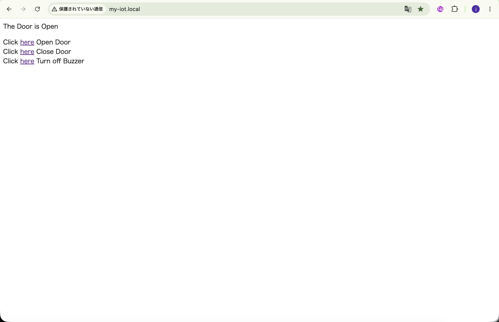
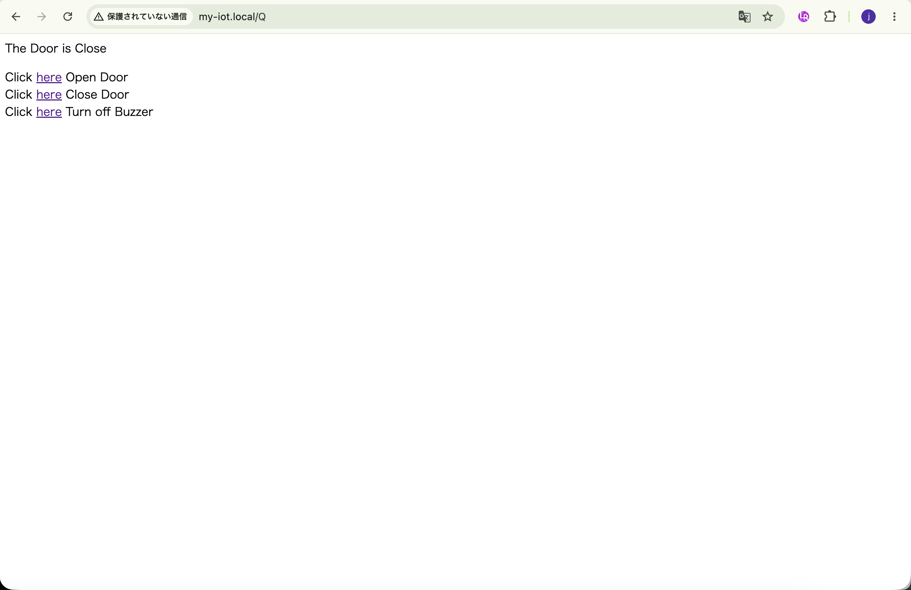

## Lesson 16: RFIDドア開閉システム (RFID Switching Door)

### 1. 目的 (Objective)

このプロジェクトでは、シンプルなRFID（ICカード）とIoTで制御されるセキュリティドアシステムを作成する。
セキュリティドアは通常、サーボモーターによって開かれることが多い。
簡素化するため、サーボを90度回転させてドアが開いた状態を模し、0度に戻してドアが閉まった状態を模する。

全体の動作手順は以下の通り：
RC522 RFIDモジュールによってICカードが検出されると、ArduinoはそのIDが記録と一致するかどうかを検証する。
IDが記録と一致した場合、サーボが90度回転する。緑色のLEDが点灯し、赤色のLEDが消灯する。
IDが記録と一致しない場合、サーボは動かず、代わりにブザーがアラームを鳴らす（リモートコンピューターのブラウザを使用してアラームをオフにする必要がある）。
いつでも、リモートブラウザからドアを開けたり（サーボを90度回転）、ドアを閉めたり（サーボを0度に戻す）、ブザーをオフにしたり、ドアの状態を監視したりできる。

### 2. 必要部品とデバイス

- OSOYOO MEGA2560ボード ×1
- OSOYOO MEGA-IoT 拡張ボード ×1
- USB ケーブル ×1
- LED モジュール 緑色 x 1, 赤色 x 1
- ブザーモジュール ×1
- マイクロサーボモーター ×1
- RFID モジュール ×1
- PnPケーブル ×3
- メス-メス ジャンパーワイヤ ×1

### 3. 作り方 (How to Make)

1. OSOYOO MEGA2560ボードの上にOSOYOO MEGA-IoT拡張ボードを差し込む。  
   （ジャンパーキャップは、ESP8266のRXとA8、TXとA9を接続するようにする）
2. 緑色LEDモジュール -- D12  
   赤色LEDモジュール -- D11  
   ブザーモジュール -- D5   
   マイクロサーボモーター -- D3     
   RFID モジュール -- RFID

### 4. コーディング (How to Code)

- Step 1: 最新のArduino IDEをインストール。（スキップ）
- Step 2: WiFiEsp-master ライブラリインストール。（スキップ）
- Step 3: 以下のリンクから RFID ライブラリインストール。  
  https://osoyoo.com/2019/10/14/osoyoo-mega-iot-shield-rfid-tutorial/
- Step 4: 以下のリンクからメインコードをダウンロードし、ZIPファイルを解凍する。（スキップ）  
  https://osoyoo.com/driver/smarthome/smarthome-lesson16.zip
- Step 5: OSOYOO MEGA2560ボードをUSBケーブルでPCに接続する。
- Step 6: Arduino IDEを開き、プロジェクトに適したボードタイプとポートタイプを選択する。
- Step 7: Arduino IDE: 「File → Open → "smarthome-lesson16"」を選択して、Arduinoにスケッチをアップロードする。
    - Step 3で取得したカード番号を使って、コードの19行目を変更する。
  ```cpp  
  unsigned char my_rfid[] = {186,11,86,89,190}; // ご自身のRFIDカード番号に置き換え  
  ```
    - 注意: スケッチ内の以下の行を見つけて、WiFiのSSIDとパスワードを自分のネットワークに合わせて変更する。
  ```cpp
  char ssid[] = "****"; // WiFiのSSIDを入力
  char pass[] = "****"; // WiFiのパスワードを入力
  ```

### 5. 実行方法 (How to Play)

スケッチをArduinoに読み込んだ後、Arduino IDEの右上にあるシリアルモニタを開くと、以下の結果が表示さる。

- シリアルモニタから、MEGA2560ボードのIPアドレスを確認できる。

**実行結果：**  
コードの19行目の値と一致するICカードを使用すると、ドアが開き（サーボが90度に回転）、緑色のLEDが点灯する。
19行目の値と一致しないICカードを使用すると、ドアは開かず、赤色のLEDが点灯し、ブザーがアラームを鳴らす。
リモートブラウザで3つのリンクのいずれかをクリックすると、リモートブラウザからドアを開けたり、ドアを閉めたり、ブザーをオフにしたりできる。

|            |                            Web                            |                    Smart Home                     |
|------------|:---------------------------------------------------------:|:-------------------------------------------------:|
| Door Open  |    |    |
| Door Close |  |  |
