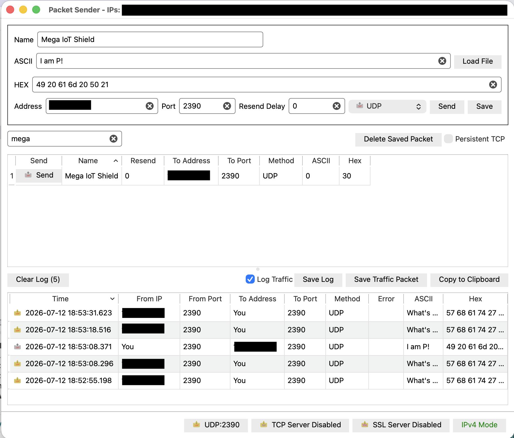
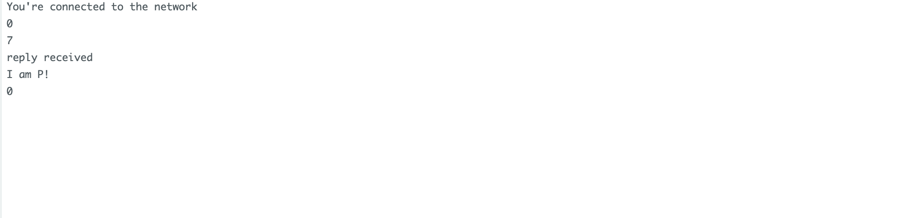

## Lesson 18: 2台のMega-IoTデバイス連携 (Two Mega-IoT Devices)

### 1. 目的 (Objective)

以前のレッスンでは、HTTPプロトコルを通じてリモートデバイスを監視・制御するために、PCのWebブラウザを使用する多くの例を学んだ。  
このようなHTTPプロトコルにはいくつかの問題がある。

第一に、メモリが限られているArduinoでWebサーバーを実行する必要がある。
そのため、パフォーマンスが遅く、安定していない。

第二に、一方向の制御（PCからリモートデバイスを制御）しかできない。
これは、多くのIoTアプリケーションで必要とされる100%のThing to Thing（モノとモノ）の接続ではない。

このレッスンでは、2つのMEGA-IoTシールドを使用して、UDPプロトコルによるThings-to-Thingsの通信を行う方法について説明する。

**このレッスンで実験を行うには、Osoyoo Mega-IoT拡張シールドが2個必要になるため注意。**

2つのIoT間で双方向通信を行うには、UDPと呼ばれる新しいインターネットプロトコルを使用する必要がある。
UDPは、電子メールやIP電話サービスで非常によく使用されている。
これは、インターネットデバイスが送信先デバイスに一方向のデータを送信できるようにする非常にシンプルなプロトコルである。
UDPソフトウェアにIPアドレスとポート番号を伝えるだけで、送信先はメッセージを受信できる。

### 2. 必要部品とデバイス

- OSOYOO MEGA2560ボード ×2
- OSOYOO MEGA-IoT 拡張ボード ×2
- USB ケーブル ×2

### 3. 作り方 (How to Make)

1. OSOYOO MEGA2560ボードの上にOSOYOO MEGA-IoT拡張ボードを差し込む。  
   （ジャンパーキャップは、ESP8266のRXとA8、TXとA9を接続するようにする）

### 4. コーディング (How to Code)

- Step 1: 最新のArduino IDEをインストール。（スキップ）
- Step 2: WiFiEsp-master ライブラリインストール。（スキップ）
- Step 3: 以下のリンクからメインコードをダウンロードし、ZIPファイルを解凍する。（スキップ）  
  https://osoyoo.com/driver/smarthome/smarthome-lesson18.zip  
  ダウンロードしたzipファイルを解凍すると、smarthome-lesson18の中に「UdpSend」と「UDPreceive」という2つのサブフォルダがある。  
  **UdpSend**は送信側のArduinoデバイスにインストールする必要がある。これはUDPデータを送信するためのもの（サンプルコードでは、メッセージは `"what's your name?"` ）
  **UDPreceive**は、送信側デバイスからデータを受信するもう一方のArduinoデバイスにインストールする必要がある。これは受信したUDPメッセージを表示し、送信側デバイスにレスポンス `"my name is alice"` を返送するためのもの）
- Step 4: OSOYOO MEGA2560ボードをUSBケーブルでPCに接続する。
- Step 5: Arduino IDEを開き、プロジェクトに適したボードタイプとポートタイプを選択する。

#### UdpReceive.inoを受信側Arduinoデバイスにロード  

- Step 6: lesson3にある受信側デバイス用のサンプルコードを実行し、受信側デバイスのIPアドレスを記録する。
- Step 7: Arduino IDE: 「File → Open → "UdpReceive.ino"」を選択して、受信側Arduinoにロードする。
    - 注意: スケッチ内の以下の行を見つけて、WiFiのSSIDとパスワードを自分のネットワークに合わせて変更する。
  ```cpp
  char ssid[] = "****"; // WiFiのSSIDを入力
  char pass[] = "****"; // WiFiのパスワードを入力
  ```

#### UdpSend.inoを送信側Arduinoデバイスにロード

- Step 8: Arduino IDE: 「File → Open → "UdpSend.ino"」を選択して、送信側Arduinoにロードする。
  - 注意: スケッチ内の以下の行を見つけて、WiFiのSSIDとパスワードを自分のネットワークに合わせて変更する。
  ```cpp
  char ssid[] = "****"; // WiFiのSSIDを入力
  char pass[] = "****"; // WiFiのパスワードを入力
  ```
  また、20行目を以下のように変更する必要がある。
  ```cpp
  char remote_server[] = "192.168.xxx.xxx"; // 受信側デバイスのIPアドレスを入力
  ```

### 5. 実行方法 (How to Play)

スケッチをArduinoに読み込んだ後、Arduino IDEの右上にあるシリアルモニタを開くと、以下の結果が表示さる。

- シリアルモニタから、MEGA2560ボードのIPアドレスを確認できる。

**実行結果：**  
ここでReceiver（受信側）のシリアルモニタを開くと、
Sender（送信側）のメッセージ「What's your name?」が表示されていることが確認できる。
ここでSenderのシリアルモニターに戻ると、Receiver（受信側）のデバイスからの新しい応答メッセージ「I am Alice」が確認できる。

|                |           UdpRecieve<br>(PacketSender)            |           UdpSend<br>(IoTシリアルモニタ)           |
|----------------|:-------------------------------------------------:|:-------------------------------------------:|
| Send - Receive |  |  |
